# Visual Diagrams in Mermaid Format

These diagrams can be rendered using Mermaid (GitHub, VS Code, or online: mermaid.live)

---

## 1. GANTT CHART (Mermaid)

---

## 2. STATE DIAGRAM - User Authentication (Mermaid)

---

## 3. STATE DIAGRAM - Prediction Workflow (Mermaid)

---

## 4. STATE DIAGRAM - Model Training (Mermaid)

---

## 5. PERT CHART (Mermaid)

---

## 6. SEQUENCE DIAGRAM - Prediction Flow (Mermaid)

---

## 7. CLASS DIAGRAM - System Architecture (Mermaid)

---

## 8. USE CASE DIAGRAM (Mermaid)

```mermaid
graph TB
    Admin[👤 Admin]
    User[👤 User]
    System[🤖 System]
    
    Admin --> |Manage Users| UC1[Manage User Accounts]
    Admin --> |View Statistics| UC2[View System Stats]
    
    User --> |Register| UC3[Create Account]
    User --> |Login| UC4[Authenticate]
    User --> |Logout| UC5[End Session]
    User --> |Upload| UC6[Upload Leaf Image]
    User --> |View| UC7[View Prediction Results]
    User --> |History| UC8[View Past Predictions]
    
    System --> |Process| UC9[Classify Disease]
    System --> |Store| UC10[Store User Data]
    System --> |Retrieve| UC11[Retrieve Disease Info]
    
    style Admin fill:#FFE4B5
    style User fill:#E0E0E0
    style System fill:#87CEEB
```

---

## How to Use These Diagrams

### Online (Recommended):
1. Go to: https://mermaid.live
2. Copy any diagram code above
3. Paste into the editor
4. Click "PNG" or "SVG" to export

### In VS Code:
1. Install "Markdown Preview Mermaid Support" extension
2. Open this file in VS Code
3. Click Preview (Ctrl+Shift+V)
4. Diagrams will render automatically

### In GitHub:
1. Create a `.md` file in your repository
2. Copy diagram code
3. Push to GitHub
4. GitHub automatically renders Mermaid diagrams!

### In Documentation:
1. Export as PNG/SVG from mermaid.live
2. Insert into Word/PowerPoint documents
3. Use for presentations and reports

---

**All diagrams are ready to use! Just copy and render! 🎨**

